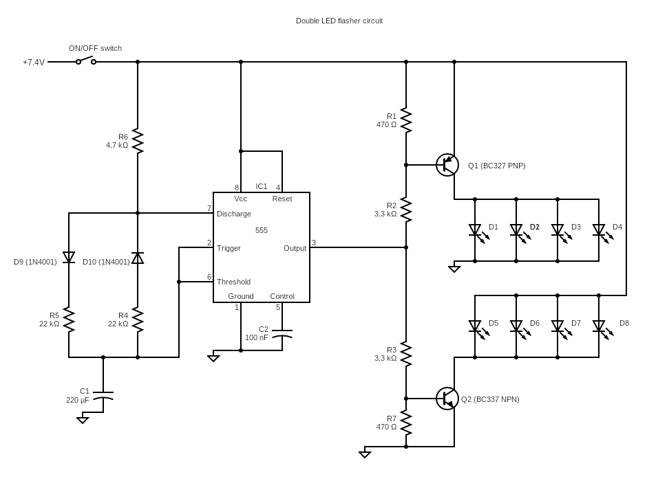

# Project: Halloween Candy Bucket

# ID:23122
---
We are on a mission to build a spooky trick-or-treat candy bucket that will be a timeless halloween accessory! Please **[watch our construction video using this link][5]** first to get a clear idea about the project BEFORE starting to build it.

Following is the working circuit diagram you will need if you want to build this circuit.

Note that the LEDs used in this circuit have their own built-in resistors and can be powered by 12 V DC directly. Therefore, powering them up directly from 7.4 V DC source is not an issue. The LEDs also come pre-soldered to a long cable, which will make life easier for you while building this project.

Another thing to note is the circuit is powered using an external Li-Ion rechargeable battery that will last a long time and (obviously) is rechargeable to make maintenance simpler.

Following are the links to the key components we used in this project in case you would like to get them too.

**[1 - Bright LEDs with built in resistors][1]**

**[2 - Li-Ion 1500 mAh 7.4 V rechargeable battery pack][2]**

**[3 - 22 AWG JST power connector (compatible with item 2 above][3]**

**[4 - The fabric candy bucket][4]**

You will need to print a copy of the artwork on the front of the fabric bucket to use as a template while building this project. This printed image needs to be at 1:1 scale. In order to save you time, we have measured and scaled the image for you. So you can simply **[download that image using this link][6]** and print it.

If you build this project, please share your thoughts and suggestions with the rest of circuitapps community in the comments section of **[our YouTube video][5]**. Also, please feel free to talk about any interesting modifications you make and your experimentations, if any !

## Project Challenges
There are a few things to be careful with while building this project to make sure you get it working after the first attempt

### **Caution 1 - Careful while making cuts on the fabric bucket**

You will be using a sharp blade to cut out various parts of the fabric bucket. Make sure you insert a cutting mat in order not to damage anything during cutting.

### **Caution 2 - Careful while applying hot glue**

Continue using the cutting mat (or a silicon mat) to avoid smearing hot glue onto the fabric bucket. This is especially important while gluing the transparent fabric to the windows and the door on the bucket.

### **Caution 3 - Battery and the switch positioning**

While gluing the top of the fabric bucket after installing the cardboard box inside, make sure the battery pack and the switch are positioned on the same side of the bucket.

## Useful tips

### **Tip 1:**
Though the LEDs come with soldered cables, depending on your design, you may need to extend the leads as needed.

### **Tip 2:**
You will need to use hot glue sparingly in this project. Therefore, use compressed air to dry the hot glue as needed to save time and to do a clean job.

GOOD LUCK & ENJOY BUILDING THIS COOL PROJECT !

[1]: https://www.amazon.com/gp/product/B01NAHYUBD/ref=ppx_yo_dt_b_search_asin_title?ie=UTF8&th=1
[2]: https://www.amazon.com/gp/product/B07DNCK7V2/ref=ppx_yo_dt_b_search_asin_image?ie=UTF8&psc=1
[3]: https://www.amazon.com/gp/product/B06WGN56V2/ref=ppx_yo_dt_b_search_asin_image?ie=UTF8&psc=1
[4]: https://www.amazon.com/gp/product/B08BRJ3L1T/ref=ppx_yo_dt_b_search_asin_image?ie=UTF8&th=1
[5]: https://youtu.be/lHvzVke-1bM
[6]:./bucket_photo_print_to_letter_US_21p54cmx27p94cm.jpg
